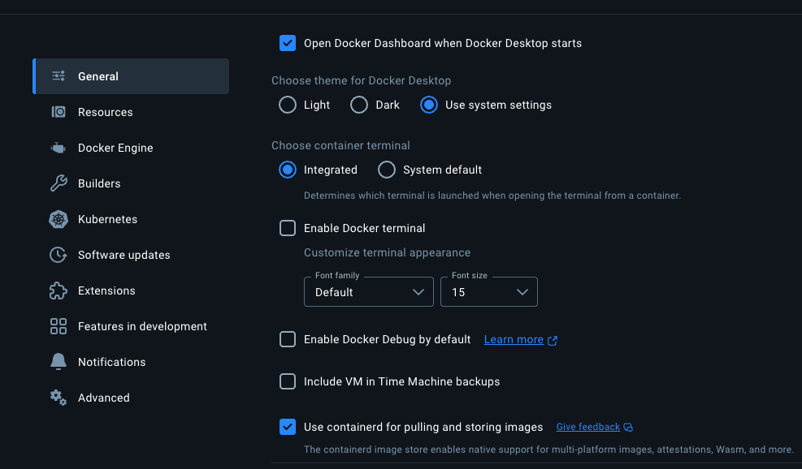

# Updating Custom Components

If you want to use a new version of the honeycombextension or usageprocessor update the versions at `cmd/otelcontribcol/builder-config.yaml`.

You can test 

# Creating Local Images

## Enabled multi-platform support in docker desktop

First, ensure Docker Desktop is using containerd for pulling and storing images.
[This is required to support storing multi-platform images.](https://docs.docker.com/build/building/multi-platform/)



## Build Image Locally

While in `cmd/opamsupervisor` run

```shell
make docker-build
```

## Push Images to hny/opampsupervisor in sandbox-telemetry

While in `cmd/opamsupervisor` run

```shell
make docker-push
```

